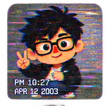

# DA Motion Sticker Skill · 九宫格动态 GIF 表情包


[English README](./README.en.md)

把一张角色参考图，变成一套干净、可交付的 3×3 动态 GIF 表情包。`da-motion-sticker-skill` 会生成透明九宫格母版、逐张动效 GIF、可选静态 PNG、处理报告与 ZIP 交付包；也支持把色幕母版交给任意视频模型后再续跑抠像与循环处理。

## 亮点

- 一张角色图 + 九项情绪/动作，或只给一个主题自动补全九项。
- 36 种预设风格；风格只改变材质、线条与造型，透明背景、无外框与格间留白始终优先。
- 两条动效路线：本地安全变换动效，或外部 AI 视频生成后的续跑处理。
- 自动检查真实 Alpha、九格完整性、透明间隔、色幕冲突、GIF 透明与循环。
- 媒体素材、任务状态、哈希和报告都保存在可移植任务目录，不记录密钥或用户主目录。

## 一键安装到 Codex

需要 Git、Python 3.10+ 与 FFmpeg。下面这条命令会直接克隆到 Codex 自动扫描的本地 Skill 目录；完成后刷新或重启 Codex。

```bash
git clone https://github.com/avocadotear/da-motion-sticker-skill.git "$HOME/.agents/skills/da-motion-sticker-skill"
```

如果该目录已存在，先不要覆盖：请进入目录执行 `git pull` 更新，或删除确认无用的旧副本后再安装。

Windows PowerShell：

```powershell
git clone https://github.com/avocadotear/da-motion-sticker-skill.git "$HOME\.agents\skills\da-motion-sticker-skill"
```

也可以在任意工作目录克隆后，以软链接方式安装（适合开发）：

```bash
git clone https://github.com/avocadotear/da-motion-sticker-skill.git
ln -s "$(pwd)/da-motion-sticker-skill" "$HOME/.agents/skills/da-motion-sticker-skill"
```

## 快速开始

在 Codex 中附上一张角色参考图，然后直接说：

```text
使用 $da-motion-sticker-skill，根据附件角色图生成九宫格动态 GIF 表情包：
开心、委屈、生气、惊讶、害羞、疑惑、点赞、再见、睡觉。
```

或让 Skill 按主题自动补全：

```text
使用 $da-motion-sticker-skill，为附件角色做一套“周一上班”主题表情包，风格选 04。
```

需要静态图时，补充“同时导出静态 PNG”；希望走视频模型时，补充“动态路线选 AI 视频生成”。

## 36 种风格一览

用编号、名称或自然语言描述选择风格。下图中的风格图随仓库提供，编号与 Skill 内的预设一一对应。

| <br><sub>01 · 低保真剪纸 Meme</sub> | <br><sub>02 · Q版大头 Chibi</sub> | <br><sub>03 · 3D 软陶 / Clay</sub> | <br><sub>04 · 3D 毛绒玩偶</sub> | <br><sub>05 · 搪胶公仔 / Vinyl Toy</sub> | <br><sub>06 · 黏土定格</sub> |
|---|---|---|---|---|---|
| <br><sub>07 · 像素 / Pixel Art</sub> | <br><sub>08 · 复古街机</sub> | <br><sub>09 · 日漫夸张表情</sub> | <br><sub>10 · 美式卡通 Meme</sub> | <br><sub>11 · 报纸漫画</sub> | <br><sub>12 · 复古漫画网点</sub> |
| <br><sub>13 · 黑白漫画</sub> | <br><sub>14 · 手绘涂鸦</sub> | <br><sub>15 · 儿童蜡笔</sub> | <br><sub>16 · 油画恶搞</sub> | <br><sub>17 · 文艺复兴名画 Meme</sub> | <br><sub>18 · 浮世绘 Meme</sub> |
| <br><sub>19 · 中国传统年画</sub> | <br><sub>20 · 国潮剪纸</sub> | <br><sub>21 · 水墨 Meme</sub> | <br><sub>22 · 刺绣 / 布艺贴章</sub> | <br><sub>23 · 毛毡布贴</sub> | <br><sub>24 · 纸雕 / Layered Paper</sub> |
| <br><sub>25 · 撕纸拼贴 Meme</sub> | <br><sub>26 · Riso 孔版印刷</sub> | <br><sub>27 · 丝网印刷</sub> | <br><sub>28 · Y2K 网络表情</sub> | <br><sub>29 · VHS / 低清截图</sub> | <br><sub>30 · Windows 95 / 复古电脑 UI</sub> |
| <br><sub>31 · Mac OS 复古系统图标</sub> | <br><sub>32 · Emoji 3D 混合</sub> | <br><sub>33 · 表情符号拟人</sub> | <br><sub>34 · Reaction GIF 截帧</sub> | <br><sub>35 · 夸张真人头 + 卡通小身体</sub> | <br><sub>36 · 半写实 3D 大头人物</sub> |

## 动效路线

| 路线 | 适合情况 | 输出方式 |
|---|---|---|
| Codex 直接生成（默认） | 想要快速、稳定、可循环的轻量动作 | 从 `bob`、`bounce`、`shake`、`nod`、`sway`、`pulse`、`tilt`、`hop` 等模板生成约 1 秒、12 fps 的透明 GIF。 |
| AI 视频生成 | 想要更复杂的角色动作 | 先导出透明/色幕母版和视频提示词，在 Grok、Seedance、豆包等工具生成视频后上传续跑。Skill 自动找格、软抠像、去色溢并选循环窗口。 |

本地路线只会移动、缩放、旋转或轻微挤压完整贴纸，不会凭空重绘局部肢体、眼泪、文字或特效。

## 交付内容

每次任务在独立运行目录中产生原子写入的 ZIP：

```text
sticker-pack.zip
├── gifs/                       # 成功的 1–9 个透明 GIF
├── png/                        # 仅请求静态输出时存在
├── source/transparent-sheet.png
├── source/chroma-sheet.png
├── prompts/image-prompt.txt
├── prompts/video-prompt.txt
├── manifest.json
└── processing-report.json
```

如果视频路线中仅部分格失败，成功 GIF 仍会进入 ZIP，失败原因写入报告；九格全部失败时不会生成空 ZIP。

## 前置条件与本地开发

运行时需要 Python 3.10+、Pillow、NumPy、FFmpeg 和 FFprobe；不使用 SciPy、Node.js 或外部视频 API。安装 Python 依赖：

```bash
python -m pip install -e .
ffmpeg -version
ffprobe -version
```

脚本入口位于 [`scripts/`](./scripts)：`create_job.py`、`inspect_sheet.py`、`prepare_assets.py`、`animate_local.py`、`process_video.py` 与 `package_job.py`。Skill 是主要编排入口，脚本用于可重复的媒体处理与测试。

## 隐私与媒体权利

任务文件保存在本地运行目录中；`job.json` 只保存相对路径、输入哈希、状态和处理结果，不写入 API 密钥或用户主目录绝对路径。请确保你拥有角色参考图、视频素材以及最终表情包的使用权；外部视频工具的上传与保留规则由该工具自身决定。

## 许可证

[MIT License](./LICENSE) · Copyright © DAAI
