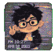

# DA Motion Sticker Skill · 九宫格动态 GIF 表情包


[English](./README.en.md) · [日本語](./README.ja.md) · [한국어](./README.ko.md)

`da-motion-sticker-skill` 把一张角色参考图做成九张独立的透明动态 GIF。最终交付包括 GIF、可选静态 PNG、透明母版、色幕母版、处理报告和 ZIP。动画可以在 Codex 内通过关键姿势生成，也可以交给外部视频工具生成后再回到本地拆分和抠像。

## 亮点

- 输入一张角色图和九项情绪、动作或 Emoji；只给主题时，Skill 会先整理成九项并请你确认。
- 内置 36 种风格。人物外缘必须直接接透明区域，不生成白边、黑色外框、阴影或格子底板。
- Codex 路线使用真实关键姿势，不再用整张 PNG 平移、旋转、缩放或抖动冒充动作。
- 视频路线支持 Grok、Seedance 2.5、豆包等图片生视频工具；视频上传后再在本地找格、抠幕和编码。
- 本地会检查 Alpha、九格留白、色幕冲突、GIF 帧数、透明索引和无限循环标记。

## 一键安装到 Codex

需要 Git 和 Python 3.9+。视频路线需要 FFmpeg 与 FFprobe；Codex 关键姿势路线也建议安装 FFmpeg，以获得更好的 GIF 调色板。下面的命令会克隆到 Codex 扫描的本地 Skill 目录，完成后刷新或重启 Codex。

```bash
git clone https://github.com/avocadotear/da-motion-sticker-skill.git "$HOME/.agents/skills/da-motion-sticker-skill"
```

如果目录已经存在，进入目录执行 `git pull --ff-only`。不要直接覆盖一个正在开发或包含未提交修改的副本。

Windows PowerShell：

```powershell
git clone https://github.com/avocadotear/da-motion-sticker-skill.git "$HOME\.agents\skills\da-motion-sticker-skill"
```

也可以在任意工作目录克隆后，以软链接方式安装（适合开发）：

```bash
git clone https://github.com/avocadotear/da-motion-sticker-skill.git
ln -s "$(pwd)/da-motion-sticker-skill" "$HOME/.agents/skills/da-motion-sticker-skill"
```

## 快速开始

在 Codex 中附上一张角色参考图，然后直接说：

```text
使用 $da-motion-sticker-skill，根据附件角色图生成九宫格动态 GIF 表情包：
开心、委屈、生气、惊讶、害羞、疑惑、点赞、再见、睡觉。
```

或让 Skill 按主题自动补全：

```text
使用 $da-motion-sticker-skill，为附件角色做一套“周一上班”主题表情包，风格选 04。
```

静态 PNG 默认不导出，需要时补充“同时导出静态 PNG”。生成九宫格并完成本地处理后，Skill 会让你选择 Codex 关键姿势路线或 AI 视频路线。

## 36 种风格一览

用编号、名称或自然语言描述选择风格。下图中的风格图随仓库提供，编号与 Skill 内的预设一一对应。

| <br><sub>01 · 低保真剪纸 Meme</sub> | <br><sub>02 · Q版大头 Chibi</sub> | <br><sub>03 · 3D 软陶 / Clay</sub> | <br><sub>04 · 3D 毛绒玩偶</sub> | <br><sub>05 · 搪胶公仔 / Vinyl Toy</sub> | <br><sub>06 · 黏土定格</sub> |
|:---:|:---:|:---:|:---:|:---:|:---:|
| <br><sub>07 · 像素 / Pixel Art</sub> | <br><sub>08 · 复古街机</sub> | <br><sub>09 · 日漫夸张表情</sub> | <br><sub>10 · 美式卡通 Meme</sub> | <br><sub>11 · 报纸漫画</sub> | <br><sub>12 · 复古漫画网点</sub> |
| <br><sub>13 · 黑白漫画</sub> | <br><sub>14 · 手绘涂鸦</sub> | <br><sub>15 · 儿童蜡笔</sub> | <br><sub>16 · 油画恶搞</sub> | <br><sub>17 · 文艺复兴名画 Meme</sub> | <br><sub>18 · 浮世绘 Meme</sub> |
| <br><sub>19 · 中国传统年画</sub> | <br><sub>20 · 国潮剪纸</sub> | <br><sub>21 · 水墨 Meme</sub> | <br><sub>22 · 刺绣 / 布艺贴章</sub> | <br><sub>23 · 毛毡布贴</sub> | <br><sub>24 · 纸雕 / Layered Paper</sub> |
| <br><sub>25 · 撕纸拼贴 Meme</sub> | <br><sub>26 · Riso 孔版印刷</sub> | <br><sub>27 · 丝网印刷</sub> | <br><sub>28 · Y2K 网络表情</sub> | <br><sub>29 · VHS / 低清截图</sub> | <br><sub>30 · Windows 95 / 复古电脑 UI</sub> |
| <br><sub>31 · Mac OS 复古系统图标</sub> | <br><sub>32 · Emoji 3D 混合</sub> | <br><sub>33 · 表情符号拟人</sub> | <br><sub>34 · Reaction GIF 截帧</sub> | <br><sub>35 · 夸张真人头 + 卡通小身体</sub> | <br><sub>36 · 半写实 3D 大头人物</sub> |

<details>
<summary>点击查看 36 种风格的动图效果</summary>

| <br><sub>01 · 低保真剪纸 Meme</sub> | <br><sub>02 · Q版大头 Chibi</sub> | <br><sub>03 · 3D 软陶 / Clay</sub> | <br><sub>04 · 3D 毛绒玩偶</sub> | <br><sub>05 · 搪胶公仔 / Vinyl Toy</sub> | <br><sub>06 · 黏土定格</sub> |
|:---:|:---:|:---:|:---:|:---:|:---:|
| <br><sub>07 · 像素 / Pixel Art</sub> | <br><sub>08 · 复古街机</sub> | <br><sub>09 · 日漫夸张表情</sub> | <br><sub>10 · 美式卡通 Meme</sub> | <br><sub>11 · 报纸漫画</sub> | <br><sub>12 · 复古漫画网点</sub> |
| <br><sub>13 · 黑白漫画</sub> | <br><sub>14 · 手绘涂鸦</sub> | <br><sub>15 · 儿童蜡笔</sub> | <br><sub>16 · 油画恶搞</sub> | <br><sub>17 · 文艺复兴名画 Meme</sub> | <br><sub>18 · 浮世绘 Meme</sub> |
| <br><sub>19 · 中国传统年画</sub> | <br><sub>20 · 国潮剪纸</sub> | <br><sub>21 · 水墨 Meme</sub> | <br><sub>22 · 刺绣 / 布艺贴章</sub> | <br><sub>23 · 毛毡布贴</sub> | <br><sub>24 · 纸雕 / Layered Paper</sub> |
| <br><sub>25 · 撕纸拼贴 Meme</sub> | <br><sub>26 · Riso 孔版印刷</sub> | <br><sub>27 · 丝网印刷</sub> | <br><sub>28 · Y2K 网络表情</sub> | <br><sub>29 · VHS / 低清截图</sub> | <br><sub>30 · Windows 95 / 复古电脑 UI</sub> |
| <br><sub>31 · Mac OS 复古系统图标</sub> | <br><sub>32 · Emoji 3D 混合</sub> | <br><sub>33 · 表情符号拟人</sub> | <br><sub>34 · Reaction GIF 截帧</sub> | <br><sub>35 · 夸张真人头 + 卡通小身体</sub> | <br><sub>36 · 半写实 3D 大头人物</sub> |

</details>

## 动效路线

| 路线 | 适合情况 | 输出方式 |
|---|---|---|
| Codex 关键姿势 | 不离开 Codex，希望动作可控 | 每张表情生成一张 2×2 姿势页：起始、预备、峰值、恢复。随后按 `起始 → 预备 → 峰值 → 恢复 → 峰值 → 预备` 本地组帧，生成透明循环 GIF。 |
| AI 视频生成 | 需要更连续、更复杂的动作 | 导出自动选色的色幕母版和视频提示词，在 Grok、Seedance 2.5、豆包等工具中生成视频。上传结果后，本地完成九格检测、边缘连通抠幕和 GIF 编码。 |

Codex 路线不会在关键姿势失败后退回整层仿射动画。某格出现换脸、换装、道具改变或没有真实姿势差异时，最多重新生成一次；仍失败就停止并报告。

当前图像生成兼容模式使用纯绿色 `#00FF00` 生成九宫格母版和关键姿势页，再由本地脚本删除与画布边缘连通的背景色并生成真实 Alpha。纯绿只用于源图；视频路线会根据人物颜色在绿、蓝、洋红、白四种幕布中重新选择冲突最小的一种。

## 交付内容

完整任务会生成下面的交付目录。只有九张 GIF 全部通过检查后，才会把任务标记为完整并生成最终 ZIP。

```text
delivery/
├── gifs/                       # 01.gif–09.gif
├── static/                     # 仅请求静态 PNG 时存在
├── first-frames/               # 透明起始帧（如存在）
├── sheet-transparent.png
├── sheet-screen.png
├── image-prompt.txt
├── video-prompt.txt            # 视频路线或已选幕布后存在
├── keypose-plan/               # Codex 路线的动作计划与逐格提示词
├── reports/
├── manifest.json
└── da-motion-sticker-pack.zip
```

中间处理失败时，成功素材和诊断报告可以保留在任务目录中，但不会把不完整结果标成完整九宫格包。

## 前置条件与本地开发

运行时需要 Python 3.9+、Pillow 和 NumPy。视频路线需要 FFmpeg 与 FFprobe；Codex 路线没有 FFmpeg 时会退回 Pillow 编码，但成色通常不如 FFmpeg 两阶段调色板。安装依赖并运行测试：

```bash
python -m pip install -r requirements.txt
python -m pytest
ffmpeg -version
ffprobe -version
```

主要脚本位于 [`scripts/`](./scripts)：

- `compile_prompts.py`：编译九宫格与视频提示词。
- `prepare_sheet.py`：纯色底转 Alpha、找格、切图和幕布选择。
- `compile_keypose_plan.py`、`prepare_keyposes.py`、`render_keypose_pack.py`：Codex 关键姿势路线。
- `process_video.py`：外部九宫格视频的裁切、抠幕与 GIF 编码。
- `package_delivery.py`：复检九张 GIF 并生成交付目录和 ZIP。
- `prepare_pet_handoff.py`：仅在用户明确要求 Codex 桌面宠物时生成后续交接文件。

## 隐私与媒体权利

任务文件保存在本地运行目录中。报告会记录输入文件路径、SHA-256、处理参数和警告，方便排查问题；公开分享报告前请先检查其中的本地路径。脚本不保存 API 密钥。请确认你有权使用角色图、视频和最终表情包；外部视频工具的上传、训练和保留规则由对应服务决定。

## 许可证

[MIT License](./LICENSE) · Copyright © DAAI

## 问题与交流

使用中遇到问题，欢迎在 GitHub [提交 Issue](https://github.com/avocadotear/da-motion-sticker-skill/issues)，也可以加微信交流：`DAAIGC2046`。看到后我会处理哈～


